# 🛡️ Level Shield

An advanced, AI-era bot-detection and anti-scraping system built specifically to protect high-value, publicly searchable aggregate datasets (like salary benchmarks, compensation comparisons, and company profiles) without degrading the user experience for legitimate humans. Developed for the **Levels.fyi Hackathon**.

Live Demo on Netlify: [https://level-shield.netlify.app](https://level-shield.netlify.app)

---

## 💡 The Core Philosophy & Idea

Aggregate data platforms like Levels.fyi are prime targets for aggressive web scrapers, automated AI training crawlers, and database exfiltration scripts. Traditional mitigations (like standard IP rate limiting or block-by-default CAPTCHAs) fall short:
1. **IP rate limits** are easily bypassed using cheap residential proxy rotation.
2. **Standard CAPTCHAs** introduce immense cognitive friction for legitimate human users, driving down engagement.
3. **Advanced headless browsers** (using Playwright/Puppeteer with stealth plugins) can perfectly spoof standard browser properties.

**Level Shield** solves this by implementing **zero-friction, behavior-driven behavioral defense**. Instead of blocking upfront, it uses passive client telemetry, cryptographic friction scaling, and active honeypot traps to detect automated scripts with high confidence.

```mermaid
graph TD
    A[Client Request] --> B[JA4 Fingerprint & Header Check]
    B --> C[Verify Signed Good-Bot Lane]
    C -- Valid Signature --> D[Allow Request - Whitelist]
    C -- Unsigned/User --> E[Unified Risk Engine]
    E --> F[Analyze Behavior DNA Telemetry]
    E --> G[Evaluate Graph of Intent Linearity]
    E --> H[Check Honeypot Traps & Canary Hits]
    F & G & H --> I[Calculate Session Risk Score: 0-100]
    I --> J[Adaptive Friction Brain Policy]
    J -- Risk < 30 --> K[Allow - Zero Friction]
    J -- Risk 30-70 --> L[Throttle / Cryptographic PoW Challenge]
    J -- Risk > 70 --> M[Inject Honey Maze & Canary Token Traps]
    J -- Risk > 90 --> N[Tarpit Delay / Hard Block]
```



---

## ⚡ Technical Architecture & Stack

Level Shield is engineered as a high-performance Next.js application that integrates real-time telemetry pipelines with automated defense triggers:

- **Frontend Framework**: Next.js 16 (App Router) + React 19 + TypeScript.
- **Interactive UI & Charts**: Premium, modern glassmorphic dark theme styled with Tailwind CSS and Vanilla CSS variables, using **Lucide React** for icons and **Recharts** for real-time traffic visualization.
- **Client Sync Layer**: SWR (Stale-While-Revalidate) with a robust client-side `localStorage` state management synchronization layer. This ensures absolute dashboard state persistence across page navigations, tab switches, and serverless cold starts.
- **Embedded Database**: Local SQLite database utilizing `better-sqlite3` for low-latency, transactional event logging (sessions, requests, mouse/scroll telemetry, canary hits).
- **Serverless Portability Layer**: Automatically detects when running inside read-only or stateless environments (like **Netlify Functions** or **AWS Lambda**). It seamlessly replicates the database to `/tmp/level_shield.db`, copying the pre-seeded demo database on cold-start to ensure zero write errors and 100% serverless capability.

---

## 🚀 The Eight Innovation Defense Layers

Level Shield protects resources using eight modular, co-operating security layers:

### 1. 🧬 Behavior DNA (Telemetry Entropy)
- **Module**: `src/lib/security/behavior-dna.ts`
- **Mechanism**: Captures mouse coordinates, click velocities, scroll trajectories, and keyboard timing cadences.
- **How it catches bots**: Humans navigate using organic, curvilinear mouse movements (high entropy) and irregular keystroke delays. Automated testing scripts (Playwright/Puppeteer) produce perfectly linear lines, instant scroll jumps, or uniform keyboard timings. If a client sends multiple requests but logs zero behavior telemetry, it is immediately flagged as a telemetry-evader.

### 2. 🍯 Honey Salary Maze (Invisible Honeypot Links)
- **Module**: `src/lib/security/honey-maze.ts`
- **Mechanism**: Injects hidden link elements in company listing pages (e.g. `<a href="/maze/[token]" style="display:none; opacity:0; pointer-events:none;">`) containing session-specific tokens.
- **How it catches bots**: Human users cannot see or interact with these links. Standard web crawlers and scraping scripts parse the DOM directly and aggressively follow every discovered URL, walking straight into the trap.

### 3. 🔑 Canary Salary Tokens (Traceable Data Injections)
- **Module**: `src/lib/security/canary.ts`
- **Mechanism**: When a session's risk score rises, the API injects synthetic, highly lucrative salary records containing unique, cryptographically signed session tokens directly into the search streams.
- **How it catches bots**: If a scraper attempts to exfiltrate or reuse these records, the beacon registers the token footprint, linking the leak back to the exact compromised session and triggering immediate blocking.

### 4. 📈 Graph of Intent (Path Linearity)
- **Module**: `src/lib/security/graph-intent.ts`
- **Mechanism**: Analyzes the sequencing and timing intervals of client page transitions.
- **How it catches bots**: Organic human browsing is highly non-linear, pausing to read pages and jumping back and forth. Bots crawl systematically, requesting company listing rows sequentially or polling directories at rigid, mathematically uniform intervals.

### 5. 🧠 Adaptive Friction Brain (Escalating Enforcement)
- **Module**: `src/lib/security/policy.ts`
- **Mechanism**: Rules-based defense escalations.
- **How it catches bots**: If a client is served a minor challenge (like a throttle or Proof-of-Work puzzle) but continues to make heavy API hits without solving it, the policy engine escalates the session's defense status (e.g., from `throttle` to `pow_challenge` to `block`).

### 6. 💻 JA4-Style Fingerprint Consistency
- **Module**: `src/lib/security/fingerprint.ts`
- **Mechanism**: Creates a lightweight, client-side JA4 fingerprint approximation using HTTP header order, accept preferences, user-agents, languages, and browser viewport telemetry.
- **How it catches bots**: Scraper frameworks and cURL requests that spoof their User-Agent header (e.g. claiming to be Chrome on macOS) fail to match the structural characteristics of actual browser telemetry, resulting in instant detection.

### 7. 🤖 AI-Agent Trap Beacon
- **Module**: `src/app/api/agent-proof/[token]/route.ts`
- **Mechanism**: Injects specific HTML tags with instruction beacons intended purely for AI crawlers (like `GPTBot` or `ClaudeBot`).
- **How it catches bots**: Legitimate good crawlers obey the robot directives, but rogue AI agents parse the hidden tags, triggering the endpoint beacon and marking themselves as hostile.

### 8. ✍️ Signed Good-Bot Lane
- **Module**: `src/lib/security/good-bot.ts`
- **Mechanism**: Provides a cryptographically secure, high-speed bypass lane for legitimate search engine crawlers (like Googlebot) using HMAC-SHA256 signatures over an HTTP timestamp, path, and replay-protected nonce.
- **How it catches bots**: Fake search engine crawlers claiming a Googlebot User-Agent fail the signature verification and are routed straight to honeypot blocks.

---

## 🎛️ Interactive Simulation Dashboard

Level Shield includes a fully integrated, premium dashboard to immediately demonstrate and test the system:

| Simulation Profile | Behaviors Generated | Resulting Defense Action |
| :--- | :--- | :--- |
| **Normal User** | Low volume, curvilinear mouse movements, irregular typing cadences. | **Allow** (Zero friction, whitelist) |
| **Power User** | Fast browsing, high volume search hits, brief PoW challenge solved. | **Allow** (Friction resolved dynamically) |
| **Request Scraper** | Rapid API query bursts, no UI behavior telemetry. | **PoW Challenge** (Friction enforced) |
| **Sequential Scraper** | Sequential index crawling, perfect uniform delay intervals. | **Blocked** (Hard blocked) |
| **Playwright Bot** | Perfectly linear mouse lines, uniform typing delays, headless Chrome headers. | **PoW Challenge / Blocked** |
| **AI Agent** | GPTBot User-Agent string, crawler beacons exfiltrated. | **Honey Maze / Blocked** |
| **Fake Googlebot** | Claims Googlebot User-Agent, signature verification fails. | **Blocked** |
| **Good Bot** | Verified Googlebot, signs requests with HMAC-SHA256 and nonces. | **Allow** (Verified Good-Bot Whitelist) |

---

## 🛠️ Local Development & Installation

### Prerequisites
- Node.js (v18.x or later)
- NPM, Yarn, or Bun

### 1. Clone & Install Dependencies
```bash
git clone https://github.com/Himanshu-Raghav1/Level_Shield.git
cd Level_Shield
npm install
```

### 2. Run the Development Server
```bash
npm run dev
```
Open [http://localhost:3000](http://localhost:3000) with your browser to explore the dashboard.

### 3. Build & Run in Production
```bash
npm run build
npm run start
```

### 4. Running CLI Simulators
Level Shield includes native Node.js automation scripts to test defense layers directly from the terminal:
```bash
# Test the simulator API profiles
npx tsx scripts/test-simulators.ts

# Test risk calculations and good bot signing
npx tsx scripts/test-phase3.ts
```

---

## 📜 Database Schema Reference

Level Shield maintains state using the following relational tables inside SQLite (`level_shield.db`):

| Table Name | Description | Key Fields |
| :--- | :--- | :--- |
| `sessions` | Unique client sessions | `id`, `user_agent`, `ip_address`, `fingerprint`, `is_good_bot` |
| `request_events` | Logs of page views and API requests | `id`, `session_id`, `url`, `method`, `referrer`, `timestamp` |
| `behavior_events` | Mouse, scroll, and keyboard timings | `id`, `session_id`, `event_type`, `details` (JSON) |
| `risk_events` | Real-time session risk scores and reasons | `id`, `session_id`, `score`, `reasons` (JSON), `confidence` |
| `defense_actions` | History of challenges and block decisions | `id`, `session_id`, `action`, `resolved` (0 or 1) |
| `canary_tokens` | Trackers linked to fake record exfiltration | `token`, `session_id`, `exposed` (0 or 1) |
| `honey_maze_hits` | Intercepted honey link navigation logs | `id`, `session_id`, `token`, `timestamp` |
| `agent_beacons` | Compromised AI agent beacon records | `id`, `session_id`, `token`, `timestamp` |
| `good_bot_nonces` | Nonce repository for good bot replay prevention | `nonce`, `timestamp` |

---

## 👥 Contributors & Branch Model

Level Shield is developed following clean agile integration workflows:
- `main`: Stable demo branch only (deploys automatically to Netlify).
- `dev`: Shared integration branch.
- Feature branches (`feat/*`): Individual component developments.

*Designed and developed with ❤️ for the Levels.fyi Hackathon.*
